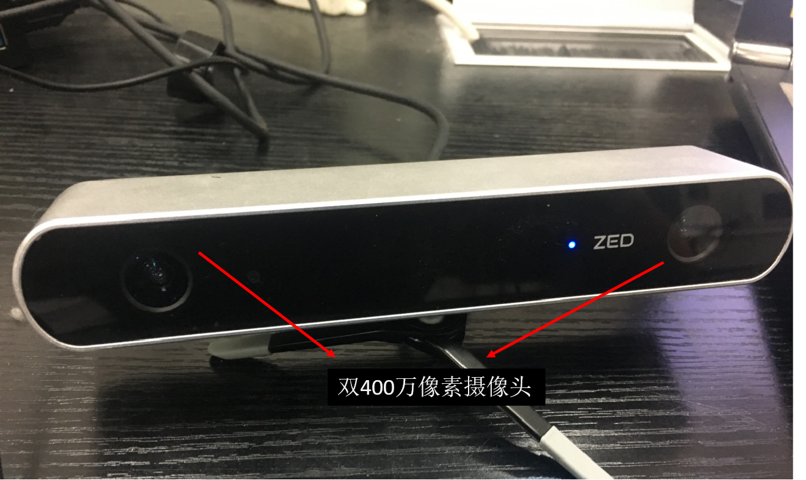

# Automatic-Tracking-System-Based-on-Bone-Recognition  
Automatic Tracking System Based on Bone Recognition.  

NOTICE:  
个人毕业设计内容，用于分享学习。  
因为已经工作，所以可能不会有下一步的更新。  

本设计基于开源OPENPOSE骨骼识别库，在ROS框架下开发。  
具体硬件参数如下：  
上位机：NVIDIA JETSON TX2  
下位机：Arduino UNO官方核心板  
摄像头：ZED双目视觉摄像机  
被控对象：现有电动轮椅平台。  

